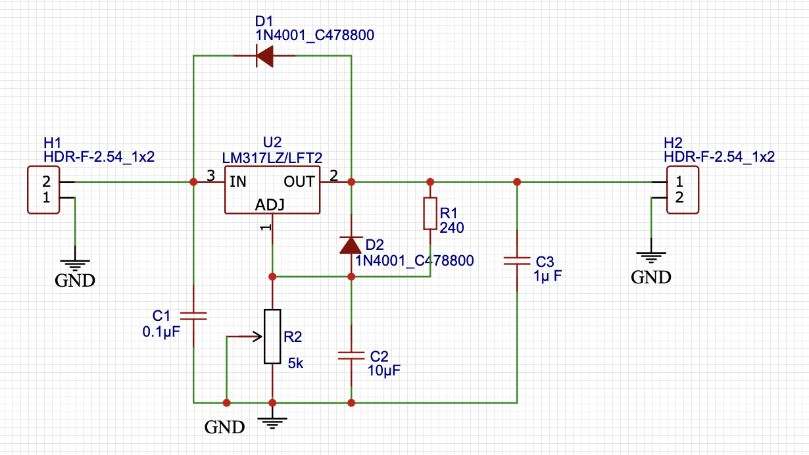
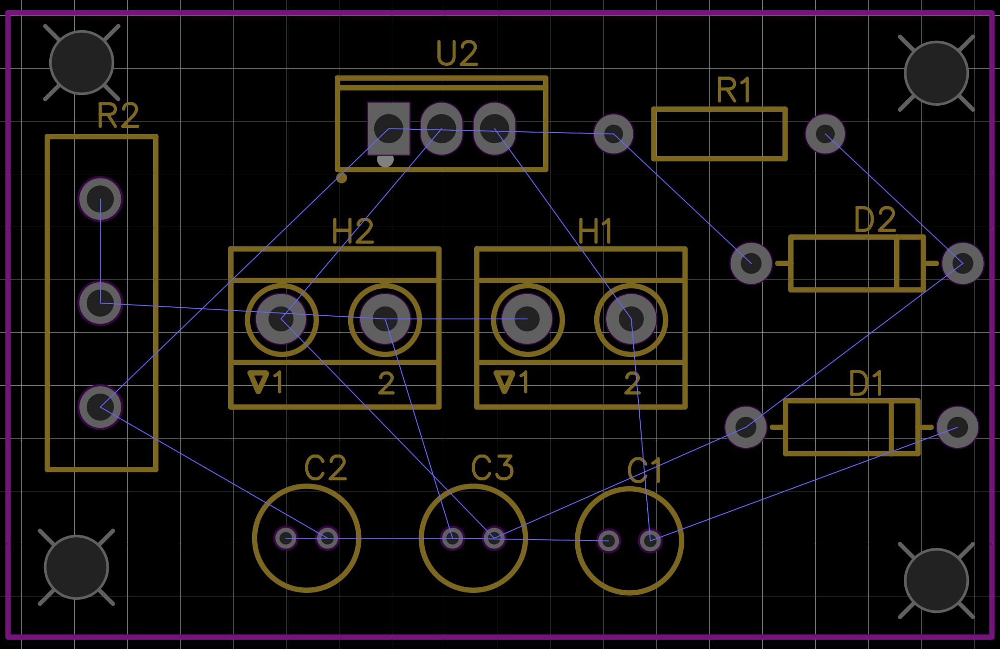
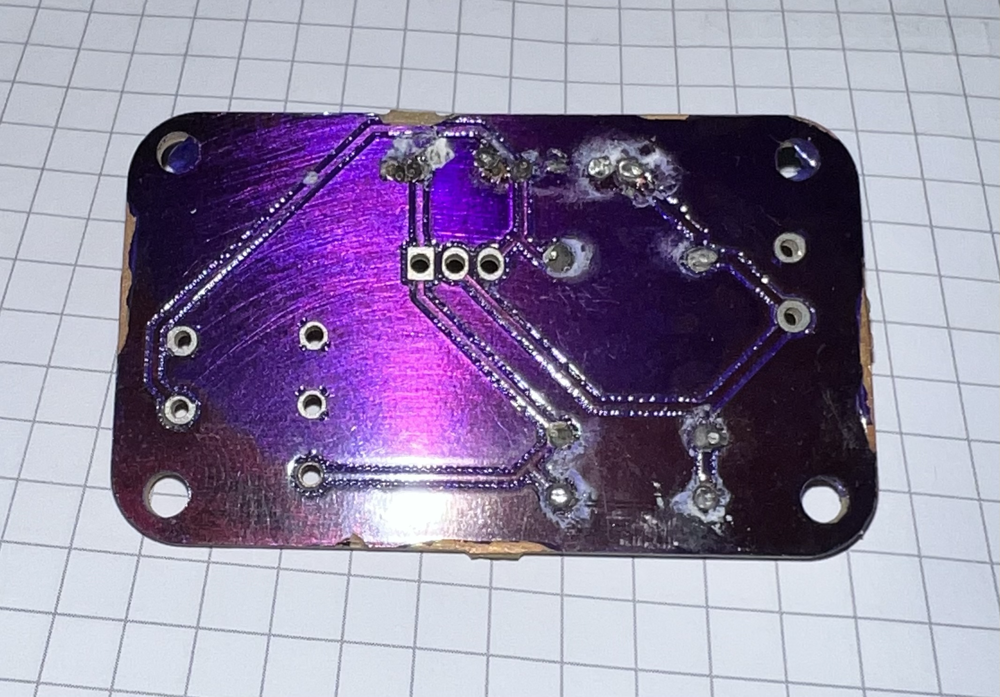

# 🔌 Regulador de Voltaje Ajustable con LM317

Este proyecto implementa un **regulador de voltaje ajustable** usando el circuito integrado **LM317**.  
El diseño incluye:

- ✅ Captura esquemática en **EasyEDA Online**  
- ✅ Selección y dimensionamiento de componentes  
- ✅ Protección con diodos para seguridad del regulador  
- ✅ Diseño del **PCB** listo para fabricación  

---

## 📷 Esquemático
Aquí se muestra el diagrama esquemático del regulador:  

---

## 🖼️ PCB Layout
Vista del diseño de PCB en EasyEDA:  

---

## 🖼️ Foto del PCB Impreso con ruteo
Foto del PCB:  

